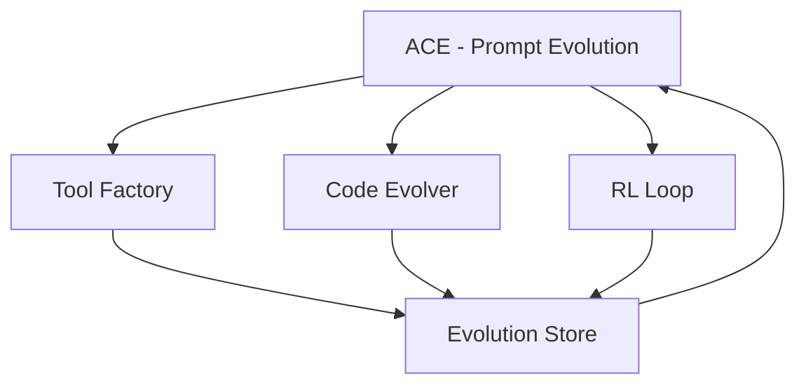

# SWE-Agent-Node 2.0 研究报告

## 概述

本文档研究了四个前沿 AI Agent 自进化方向，分析其实现原理、挑战和整合策略。

---

## 1. Live-SWE-agent - 运行时工具合成

### 1.1 核心概念

Live-SWE-agent 的核心思想是：**Agent 在运行时动态创建新工具**，而不是依赖预定义的工具集。

### 1.2 技术实现

```
┌─────────────────────────────────────────────────────────────┐
│                     Tool Factory                             │
├─────────────────────────────────────────────────────────────┤
│  1. 需求分析：LLM 分析当前任务，识别缺失的工具能力          │
│  2. 代码生成：LLM 生成工具代码（TypeScript/JavaScript）     │
│  3. 安全验证：静态分析 + 沙箱执行                           │
│  4. 动态注册：将新工具添加到工具注册表                       │
│  5. 能力扩展：立即可用于后续任务                             │
└─────────────────────────────────────────────────────────────┘
```

### 1.3 关键技术点

#### 工具合成流程
```typescript
interface ToolRequirement {
  name: string;           // 工具名称
  description: string;    // 功能描述
  inputSchema: JSONSchema; // 输入参数 Schema
  expectedOutput: string;  // 预期输出
}

class ToolFactory {
  async synthesize(requirement: ToolRequirement): Promise<Tool> {
    // 1. 生成工具代码
    const code = await this.llm.generate(`
      Create a tool that: ${requirement.description}
      Input schema: ${JSON.stringify(requirement.inputSchema)}
      Expected output: ${requirement.expectedOutput}
    `);
    
    // 2. 静态分析
    const analysis = this.analyzer.check(code);
    if (analysis.hasDangerousPatterns) {
      throw new SecurityError('Unsafe code detected');
    }
    
    // 3. 沙箱执行
    const tool = await this.sandbox.eval(code);
    
    // 4. 功能测试
    const testPassed = await this.testTool(tool, requirement);
    if (!testPassed) {
      throw new ValidationError('Tool does not meet requirements');
    }
    
    // 5. 注册
    this.registry.register(requirement.name, tool);
    return tool;
  }
}
```

#### 安全沙箱设计
```javascript
// 使用 vm2 或 isolated-vm 进行沙箱隔离
const { VM } = require('vm2');

const sandbox = new VM({
  timeout: 5000,           // 5 秒超时
  sandbox: {
    // 只暴露安全的 API
    console: createSafeConsole(),
    fetch: createSandboxedFetch(),
    // 禁止文件系统、网络、进程等危险 API
  }
});
```

### 1.4 挑战与解决方案

| 挑战 | 解决方案 |
|------|----------|
| 安全性 | 多层沙箱 + 静态分析 + 白名单 API |
| 性能 | 工具缓存 + 懒加载 + 预编译 |
| 可靠性 | 自动测试 + 回滚机制 + 版本控制 |
| 复杂性 | 工具组合 + 模块化设计 + 依赖管理 |

### 1.5 参考实现

- **LangChain Dynamic Tools**: 运行时创建工具
- **AutoGPT Plugins**: 动态加载插件系统
- **OpenAI Function Calling**: 自动生成函数调用

---

## 2. SICA - Self-Improving Coding Agent

### 2.1 核心概念

SICA 的核心思想是：**Agent 直接修改自己的源码**，实现真正的自我进化。

### 2.2 技术实现

```
┌─────────────────────────────────────────────────────────────┐
│                    Code Evolver                              │
├─────────────────────────────────────────────────────────────┤
│  1. 性能监控：记录 Agent 在任务中的表现（成功率、耗时等）    │
│  2. 瓶颈识别：分析失败案例，定位可改进的代码模块            │
│  3. 修改策略：生成安全的代码修改方案                        │
│  4. 形式化验证：确保修改不会破坏现有功能                    │
│  5. 渐进部署：A/B 测试 + 灰度发布                           │
│  6. 回滚机制：出现问题时自动回滚                            │
└─────────────────────────────────────────────────────────────┘
```

### 2.3 安全修改策略

```typescript
interface CodeModification {
  targetFile: string;      // 目标文件
  modificationType: 'add' | 'modify' | 'delete';
  oldCode?: string;        // 原代码（用于验证）
  newCode: string;         // 新代码
  reason: string;          // 修改原因
  riskLevel: 'low' | 'medium' | 'high';
}

class SafeModifier {
  async modify(mod: CodeModification): Promise<ModificationResult> {
    // 1. 备份当前状态
    const backup = await this.backup.create();
    
    // 2. 静态分析
    const impact = this.analyzer.analyzeImpact(mod);
    if (impact.riskLevel === 'high') {
      return { success: false, reason: 'Risk too high' };
    }
    
    // 3. 类型检查
    const typeErrors = await this.typeChecker.check(mod.newCode);
    if (typeErrors.length > 0) {
      return { success: false, reason: 'Type errors', errors: typeErrors };
    }
    
    // 4. 单元测试
    const testResult = await this.runAffectedTests(mod.targetFile);
    if (!testResult.passed) {
      return { success: false, reason: 'Tests failed', failures: testResult.failures };
    }
    
    // 5. 应用修改
    await this.fileSystem.write(mod.targetFile, mod.newCode);
    
    // 6. 集成测试
    const integrationResult = await this.runIntegrationTests();
    if (!integrationResult.passed) {
      // 回滚
      await this.backup.restore(backup);
      return { success: false, reason: 'Integration tests failed' };
    }
    
    // 7. 记录修改历史
    this.history.record(mod, backup);
    
    return { success: true, backupId: backup.id };
  }
}
```

### 2.4 修改策略层次

```yaml
# 修改策略配置
modification_strategies:
  low_risk:
    - 添加新的工具函数（不影响现有功能）
    - 优化代码注释和文档
    - 重构内部实现（接口不变）
  
  medium_risk:
    - 修改 Prompt 模板
    - 调整参数默认值
    - 优化算法复杂度
  
  high_risk:
    - 修改核心数据结构
    - 改变 Agent 行为逻辑
    - 删除或重构公共接口
```

### 2.5 挑战与解决方案

| 挑战 | 解决方案 |
|------|----------|
| 系统崩溃 | 多层备份 + 自动回滚 + 容器隔离 |
| 修改传播 | 依赖分析 + 影响评估 + 渐进部署 |
| 行为验证 | 形式化验证 + 自动化测试 + A/B 测试 |
| 伦理风险 | 人工审批 + 透明度 + 可解释性 |

### 2.6 参考实现

- **GitHub Copilot**: 自动代码生成
- **Cursor AI**: AI 辅助代码修改
- **Self-Modifying Code**: 历史上的自修改程序研究

---

## 3. ACE - Agentic Context Engineering

### 3.1 核心概念

ACE 的核心思想是：**通过演化系统提示词（Prompt）来改进 Agent**，不修改代码。

### 3.2 技术实现

```
┌─────────────────────────────────────────────────────────────┐
│                   Context Engineer                           │
├─────────────────────────────────────────────────────────────┤
│  1. Prompt 模板库：结构化的提示词模板                        │
│  2. 经验收集：记录任务执行过程中的成功/失败经验              │
│  3. 增量更新：基于经验生成新的提示词片段                    │
│  4. 效果评估：A/B 测试新提示词的效果                        │
│  5. 沉淀融合：将有效的更新合并到主提示词                    │
└─────────────────────────────────────────────────────────────┘
```

### 3.3 Prompt 模板结构

```typescript
interface PromptTemplate {
  id: string;
  version: string;
  category: 'system' | 'task' | 'tool' | 'error_handling';
  sections: PromptSection[];
  metadata: {
    createdAt: Date;
    updatedAt: Date;
    performanceScore: number;
    usageCount: number;
  };
}

interface PromptSection {
  name: string;
  content: string;
  priority: number;  // 高优先级的内容更重要
  mutable: boolean;  // 是否允许自动修改
}

// 示例：系统提示词模板
const systemPromptTemplate: PromptTemplate = {
  id: 'system-main',
  version: '2.1.0',
  category: 'system',
  sections: [
    {
      name: 'identity',
      content: 'You are SWE-Agent-Node, an AI software engineering assistant.',
      priority: 10,
      mutable: false
    },
    {
      name: 'capabilities',
      content: `
        You can:
        - Analyze code repositories
        - Fix bugs and issues
        - Generate tests
        - Refactor code
      `,
      priority: 8,
      mutable: false
    },
    {
      name: 'learned_patterns',
      content: '',  // 由经验填充
      priority: 5,
      mutable: true
    },
    {
      name: 'error_handling',
      content: '',  // 由经验填充
      priority: 6,
      mutable: true
    }
  ],
  metadata: {
    createdAt: new Date('2026-02-20'),
    updatedAt: new Date('2026-02-24'),
    performanceScore: 0.85,
    usageCount: 1234
  }
};
```

### 3.4 增量更新机制

```typescript
class PromptEvolver {
  async evolveFromExperience(experience: TaskExperience): Promise<PromptUpdate> {
    // 1. 分析经验
    const insight = this.analyzeExperience(experience);
    
    // 2. 生成更新建议
    const update = await this.generateUpdate(insight);
    
    // 3. 验证更新
    const validation = this.validateUpdate(update);
    if (!validation.valid) {
      throw new Error(`Invalid update: ${validation.reason}`);
    }
    
    // 4. A/B 测试
    const testResult = await this.abTest(update);
    
    // 5. 如果效果好，应用更新
    if (testResult.improvement > 0.05) {  // 5% 提升
      await this.applyUpdate(update);
      this.recordEvolution(update, testResult);
    }
    
    return update;
  }
  
  private async generateUpdate(insight: ExperienceInsight): Promise<PromptUpdate> {
    // 使用 LLM 生成新的提示词片段
    const newSection = await this.llm.generate(`
      Based on this experience:
      ${insight.description}
      
      Generate a concise prompt section that will help future agents:
      - Avoid this mistake: ${insight.mistake}
      - Apply this success: ${insight.success}
      
      Format: 3-5 sentences, actionable, specific.
    `);
    
    return {
      targetSection: insight.relevantSection,
      updateType: 'append',  // 或 'replace', 'prepend'
      newContent: newSection,
      confidence: insight.confidence
    };
  }
}
```

### 3.5 防止 Prompt 膨胀

```typescript
class PromptPruner {
  async prune(template: PromptTemplate): Promise<PromptTemplate> {
    const pruned = { ...template };
    
    // 1. 移除低效用的内容
    for (const section of pruned.sections) {
      if (section.mutable) {
        const utility = await this.measureUtility(section);
        if (utility < 0.1) {  // 低于 10% 效用
          section.content = this.summarize(section.content);  // 压缩
        }
      }
    }
    
    // 2. 合并重复内容
    pruned.sections = this.mergeSimilarSections(pruned.sections);
    
    // 3. 限制总长度
    const totalLength = this.calculateLength(pruned);
    if (totalLength > this.maxLength) {
      pruned.sections = this.prioritizeSections(pruned.sections, this.maxLength);
    }
    
    return pruned;
  }
}
```

### 3.6 挑战与解决方案

| 挑战 | 解决方案 |
|------|----------|
| Prompt 膨胀 | 自动压缩 + 效用评估 + 长度限制 |
| 更新冲突 | 版本控制 + 合并策略 + 优先级系统 |
| 效果评估 | A/B 测试 + 长期追踪 + 多维度指标 |
| 可解释性 | 更新日志 + 变更追溯 + 人工审查 |

### 3.7 参考实现

- **Prompt Programming**: 提示词工程最佳实践
- **Anthropic Constitutional AI**: 基于原则的提示词设计
- **OpenAI System Messages**: 系统级提示词

---

## 4. AgentEvolver - 强化学习闭环

### 4.1 核心概念

AgentEvolver 的核心思想是：**通过自我提问和细粒度归因，构建强化学习环境，实现自主训练**。

### 4.2 技术实现

```
┌─────────────────────────────────────────────────────────────┐
│                     RL Loop                                  │
├─────────────────────────────────────────────────────────────┤
│  1. 自我提问：Agent 生成探索性问题                           │
│  2. 环境交互：在沙箱环境中执行动作                           │
│  3. 奖励计算：基于任务成功率和代码质量                       │
│  4. 细粒度归因：分析哪些决策导致了成功/失败                  │
│  5. 策略优化：更新 Agent 的决策模型                          │
│  6. 探索利用平衡：ε-greedy 或 Upper Confidence Bound         │
└─────────────────────────────────────────────────────────────┘
```

### 4.3 自我提问机制

```typescript
interface SelfQuestion {
  id: string;
  question: string;
  type: 'exploration' | 'verification' | 'reflection';
  context: {
    currentTask: Task;
    agentState: AgentState;
    history: Action[];
  };
}

class SelfQuestioner {
  async generateQuestions(context: AgentContext): Promise<SelfQuestion[]> {
    const questions: SelfQuestion[] = [];
    
    // 探索性问题：探索未知领域
    questions.push({
      id: generateId(),
      question: 'What if I try a different search strategy?',
      type: 'exploration',
      context
    });
    
    // 验证性问题：验证当前假设
    questions.push({
      id: generateId(),
      question: 'Does this solution handle edge cases?',
      type: 'verification',
      context
    });
    
    // 反思性问题：回顾过去决策
    questions.push({
      id: generateId(),
      question: 'Why did the previous approach fail?',
      type: 'reflection',
      context
    });
    
    return questions;
  }
}
```

### 4.4 细粒度归因

```typescript
interface Attribution {
  actionId: string;
  contribution: number;  // -1 到 1，负值表示有害，正值表示有益
  confidence: number;    // 0 到 1
  reason: string;
}

class AttributionAnalyzer {
  async analyze(trajectory: Trajectory): Promise<Attribution[]> {
    const attributions: Attribution[] = [];
    
    // 使用反事实推理（Counterfactual Reasoning）
    for (const action of trajectory.actions) {
      // 1. 模拟：如果不执行这个动作会怎样？
      const counterfactual = await this.simulateWithout(
        trajectory,
        action.id
      );
      
      // 2. 比较结果差异
      const delta = this.compareOutcomes(
        trajectory.outcome,
        counterfactual.outcome
      );
      
      // 3. 计算贡献度
      const contribution = this.calculateContribution(delta);
      
      attributions.push({
        actionId: action.id,
        contribution,
        confidence: counterfactual.confidence,
        reason: this.explainContribution(action, contribution)
      });
    }
    
    return attributions;
  }
}
```

### 4.5 强化学习环境

```typescript
interface RLEnvironment {
  state: AgentState;
  actions: Action[];
  reward: number;
  done: boolean;
  info: {
    taskSuccess: boolean;
    codeQuality: number;
    timeTaken: number;
  };
}

class AgentTrainer {
  async trainEpisode(): Promise<TrainingResult> {
    let state = this.environment.reset();
    let totalReward = 0;
    const trajectory: Action[] = [];
    
    while (!state.done) {
      // 1. 选择动作（探索 vs 利用）
      const action = this.selectAction(state);
      
      // 2. 执行动作
      const nextState = await this.environment.step(action);
      
      // 3. 记录轨迹
      trajectory.push(action);
      
      // 4. 累积奖励
      totalReward += nextState.reward;
      
      // 5. 更新状态
      state = nextState;
    }
    
    // 6. 归因分析
    const attributions = await this.attributionAnalyzer.analyze({
      actions: trajectory,
      outcome: state.info
    });
    
    // 7. 策略更新
    await this.updatePolicy(trajectory, attributions, totalReward);
    
    return {
      totalReward,
      taskSuccess: state.info.taskSuccess,
      trajectory,
      attributions
    };
  }
  
  private selectAction(state: AgentState): Action {
    // ε-greedy 策略
    if (Math.random() < this.epsilon) {
      // 探索：随机选择
      return this.randomAction(state);
    } else {
      // 利用：选择最优动作
      return this.bestAction(state);
    }
  }
}
```

### 4.6 奖励函数设计

```typescript
function calculateReward(outcome: TaskOutcome): number {
  let reward = 0;
  
  // 1. 任务成功奖励
  if (outcome.taskSuccess) {
    reward += 10.0;
  } else {
    reward -= 5.0;
  }
  
  // 2. 代码质量奖励
  reward += outcome.codeQuality * 2.0;  // 0-1 → 0-2
  
  // 3. 效率奖励（时间）
  const timeBonus = Math.max(0, 1 - outcome.timeTaken / outcome.timeLimit);
  reward += timeBonus * 1.0;
  
  // 4. 代码质量惩罚（复杂度）
  if (outcome.codeComplexity > 10) {
    reward -= 0.5;
  }
  
  // 5. 安全惩罚（危险操作）
  if (outcome.hasDangerousOperations) {
    reward -= 2.0;
  }
  
  return reward;
}
```

### 4.7 挑战与解决方案

| 挑战 | 解决方案 |
|------|----------|
| 奖励设计 | 多目标奖励 + 人工反馈 + 课程学习 |
| 探索效率 | 好奇心驱动 + 内在动机 + 分层探索 |
| 样本效率 | 经验回放 + 模仿学习 + 迁移学习 |
| 安全性 | 安全约束 + 人工审查 + 沙箱隔离 |

### 4.8 参考实现

- **OpenAI Gym**: 强化学习环境标准
- **DeepMind AlphaGo**: 自我对弈训练
- **Anthropic RLHF**: 人类反馈强化学习

---

## 5. 整合策略

### 5.1 四方向协同

```
┌─────────────────────────────────────────────────────────────┐
│                  SWE-Agent-Node 2.0                          │
├─────────────────────────────────────────────────────────────┤
│                                                              │
│  ┌──────────────┐     ┌──────────────┐                      │
│  │    ACE       │────▶│   Context    │ ◀── Prompt Evolution │
│  │ (Prompt)     │     │   Manager    │                      │
│  └──────────────┘     └──────┬───────┘                      │
│         │                     │                              │
│         │                     ▼                              │
│         │              ┌──────────────┐                      │
│         │              │   Agent      │                      │
│         │              │   Core       │                      │
│         │              └──────┬───────┘                      │
│         │                     │                              │
│         │        ┌────────────┼────────────┐                 │
│         │        ▼            ▼            ▼                 │
│         │  ┌──────────┐ ┌──────────┐ ┌──────────┐           │
│         │  │  Tool    │ │  Code    │ │   RL     │           │
│         │  │ Factory  │ │ Evolver  │ │  Loop    │           │
│         │  └──────────┘ └──────────┘ └──────────┘           │
│         │        │            │            │                 │
│         │        └────────────┼────────────┘                 │
│         │                     ▼                              │
│         │              ┌──────────────┐                      │
│         └─────────────▶│  Evolution   │                      │
│                        │    Store     │                      │
│                        └──────────────┘                      │
│                                                              │
└─────────────────────────────────────────────────────────────┘
```

### 5.2 数据流

1. **任务输入** → ACE 解析任务，提供上下文
2. **工具需求** → Tool Factory 动态创建工具
3. **代码修改** → Code Evolver 安全修改源码
4. **学习反馈** → RL Loop 归因和优化
5. **经验沉淀** → 所有模块输出到 Evolution Store

### 5.3 实现优先级

| 模块 | 优先级 | 难度 | 价值 | 周期 |
|------|--------|------|------|------|
| ACE | P0 | ⭐ | ⭐⭐⭐⭐ | 1-2 周 |
| Tool Factory | P1 | ⭐⭐⭐ | ⭐⭐⭐⭐⭐ | 2-3 周 |
| RL Loop | P2 | ⭐⭐⭐⭐ | ⭐⭐⭐ | 3-4 周 |
| Code Evolver | P3 | ⭐⭐⭐⭐⭐ | ⭐⭐⭐⭐ | 4-6 周 |

### 5.4 依赖关系



---

## 6. 风险评估

### 6.1 技术风险

| 风险 | 影响 | 缓解措施 |
|------|------|----------|
| Prompt 膨胀导致 Token 成本过高 | 高 | 自动压缩 + 效用评估 |
| 动态工具执行导致安全漏洞 | 严重 | 多层沙箱 + 静态分析 |
| 源码修改导致系统崩溃 | 严重 | 自动备份 + 回滚机制 |
| RL 训练不稳定 | 中 | 课程学习 + 人工监督 |

### 6.2 伦理风险

| 风险 | 影响 | 缓解措施 |
|------|------|----------|
| Agent 自主修改代码可能导致不可控行为 | 严重 | 人工审批 + 透明度 + 审计日志 |
| 强化学习可能学习到有害策略 | 高 | 安全约束 + 人类反馈 + 红队测试 |
| Prompt 演化可能偏离原始目标 | 中 | 定期审查 + 回滚能力 + 版本控制 |

---

## 7. 结论

四个方向各有优势：

- **ACE**: 最容易实现，立即可用，适合快速迭代
- **Tool Factory**: 高价值，动态扩展能力，适合复杂任务
- **RL Loop**: 长期收益，自主训练，适合持续改进
- **Code Evolver**: 最复杂，最大风险，最大潜力

**推荐实施路线**: 先实现 ACE（P0），然后 Tool Factory（P1），再 RL Loop（P2），最后 Code Evolver（P3）。

---

*研究报告版本: 1.0.0*
*创建日期: 2026-02-24*
*作者: SWE-Agent-Node Evolution System*
